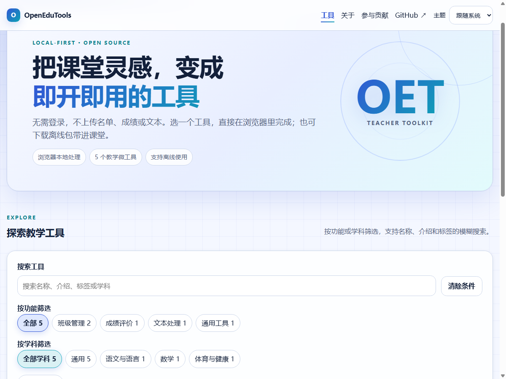

# OpenEduTools

> 免费、开源、无需登录、浏览器本地运行的教师微工具集合。

**[在线使用 OpenEduTools](https://xingyezn.github.io/OpenEduTools/)** · [GitHub 源代码仓库](https://github.com/xingyezn/OpenEduTools)



OpenEduTools 面向一线教师、教育管理人员、教育研究者、师范生与研究生，解决备课、课堂教学、班级管理、成绩评价、科研辅助、文本与数据处理中的“小而烦”问题。

项目采用 **HTML5 + CSS3 + Vanilla JavaScript** 开发，通过 GitHub Pages 发布。核心工具无需服务器、数据库或账号系统；用户输入的数据和文件原则上只在浏览器本地处理。

## 核心原则

- **Browser First**：现代浏览器是默认运行环境。
- **Local First**：可以在本地完成的处理不发送到网络。
- **No Backend**：核心功能不依赖自建后端服务；统计是可选的旁路能力。
- **Anonymous Analytics**：只统计匿名的工具打开、使用、收藏和分享次数，不含任何用户输入。
- **No Login**：打开网页即可使用。
- **Open Source**：代码、规范与协作过程公开透明。
- **One Tool, One Job**：每个工具优先解决一个明确问题。
- **Progressive Enhancement**：基础能力优先，兼容性与体验逐步增强。

## V0.1 目标

V0.1 聚焦一个可公开使用、可持续扩展的最小版本：

- 工具首页、跨名称/介绍/标签的模糊搜索、功能与学科筛选；
- 收藏与最近使用（仅保存在浏览器 `localStorage`）；
- 统一的工具卡片、详情页、导航、表单和反馈样式；
- 使用 `tool.json` 管理工具元数据；
- 响应式布局、键盘操作、基础无障碍和明暗主题；
- 10 个首批工具：随机点名、随机分组、课堂计时器、文本清洗、成绩统计、手写数字收集、课堂噪音计、全屏时钟、番茄钟、Markdown 转 Word；
- 每个工具可下载独立离线包，解压后双击即可使用；
- 匿名使用统计（工具打开、使用、收藏、分享计数）与首页热门排行；
- GitHub Pages 自动部署；
- 面向传统开发与 Vibe Coding 的贡献流程。

完整任务见 [docs/V0.1_TASKS.md](docs/V0.1_TASKS.md)。

V0.1 的静态站点、10 个首批工具、元数据工具链、自动化测试和 Pages 工作流已经实现。可直接访问 [线上站点](https://xingyezn.github.io/OpenEduTools/)；当前测试记录见 [docs/TEST_REPORT.md](docs/TEST_REPORT.md)，发布前人工验收项见 [docs/RELEASE_CHECKLIST.md](docs/RELEASE_CHECKLIST.md)。

## 目录结构

```text
OpenEduTools/
├── index.html                 # 首页与工具目录
├── about.html                 # 项目介绍与隐私说明
├── contribute.html            # 贡献入口
├── 404.html
├── assets/
│   ├── icons/
│   └── images/
├── css/
│   ├── tokens.css             # 设计变量
│   ├── main.css               # 全站基础样式
│   ├── components.css         # 公共组件
│   └── tool.css               # 工具页公共样式
├── js/
│   ├── app.js                 # 首页初始化
│   ├── catalog.js             # 元数据加载与工具目录
│   ├── search.js              # 搜索与筛选
│   ├── favorites.js           # 收藏
│   ├── recent.js              # 最近使用
│   ├── theme.js               # 主题
│   ├── analytics.js           # 匿名统计客户端（唯一上报入口）
│   ├── format.js              # 计数格式化
│   └── tool-page.js           # 工具页公共行为
├── data/
│   ├── tools.json             # 供首页读取的工具索引
│   └── stats.json             # 每日聚合的公开统计
├── worker/                    # Cloudflare Worker + D1 统计服务（独立 Node 项目）
│   ├── src/index.js
│   ├── schema.sql
│   └── wrangler.jsonc
├── downloads/                 # 自动生成的单工具离线 ZIP
├── tools/
│   └── <tool-id>/
│       ├── index.html
│       ├── style.css
│       ├── script.js
│       └── tool.json
├── scripts/
│   ├── build-tools-index.mjs  # 从 tool.json 生成 tools.json
│   └── validate-tools.mjs     # 校验元数据和必要文件
├── tests/
├── docs/
│   ├── TOOL_SPEC.md           # 工具实现与验收规范
│   ├── V0.1_TASKS.md          # 版本范围与任务清单
│   └── RELEASE_CHECKLIST.md  # 发布前人工与线上验收
├── .github/
│   ├── ISSUE_TEMPLATE/
│   ├── pull_request_template.md
│   └── workflows/
│       ├── validate.yml
│       ├── deploy-pages.yml
│       └── update-stats.yml
├── README.md
├── CONTRIBUTING.md
├── PRIVACY.md
└── LICENSE
```

> 运行网站不需要 Node.js。`scripts/` 中的 Node.js 脚本只用于维护者生成索引、校验贡献和持续集成；`worker/` 中的 Cloudflare Worker 单独使用 Node.js / Wrangler 开发和部署。

## 快速开始

### 直接预览单个工具

进入某个 `tools/<tool-id>/` 目录，双击 `index.html`。工具的核心能力应在这种方式下可用。

### 预览完整网站

由于首页会通过 `fetch()` 读取 `data/tools.json`，建议在仓库根目录启动任意静态文件服务器，例如：

```bash
python -m http.server 8000
```

然后访问 `http://localhost:8000/`。

### 维护者校验

如已安装当前 LTS 版本的 Node.js：

```bash
npm run check
```

单独生成工具索引：

```bash
npm run build:index
```

生成 10 个工具的离线包：

```bash
npm run build:downloads
```

完整检查包含元数据、索引和离线包同步、核心单元测试、关键相对路径以及静态隐私/网络规则。运行网站本身不需要 Node.js 或安装依赖。

本机已安装 Chrome 或 Edge 时，可在静态服务器运行期间执行真实浏览器烟雾测试：

```bash
npm run smoke:chrome
npm run smoke:edge
```

## 工具如何工作

每个工具位于独立目录，至少包含：

```text
tools/random-picker/
├── index.html
├── style.css
├── script.js
└── tool.json
```

`tool.json` 是工具的唯一元数据源；仓库脚本将所有工具元数据汇总为 `data/tools.json`，供首页搜索、分类和卡片展示使用。

示例：

```json
{
  "$schema": "../../schemas/tool.schema.json",
  "id": "random-picker",
  "name": "随机点名",
  "description": "从学生名单中公平地随机抽取一人。",
  "category": "classroom-management",
  "subjects": ["general"],
  "tags": ["点名", "随机", "名单"],
  "version": "0.1.0",
  "status": "stable",
  "entry": "tools/random-picker/index.html",
  "icon": "user-round-search",
  "offline": true,
  "dataPolicy": "local-only",
  "featured": true,
  "createdAt": "2026-09-20",
  "updatedAt": "2026-09-20"
}
```

字段、目录、交互、隐私和验收要求见 [docs/TOOL_SPEC.md](docs/TOOL_SPEC.md)。

## 分类

V0.1 使用以下稳定分类 ID：

| ID | 中文名称 | 示例 |
| --- | --- | --- |
| `lesson-planning` | 备课教学 | 教案结构、课堂活动 |
| `classroom-management` | 班级管理 | 随机点名、随机分组 |
| `assessment` | 成绩评价 | 成绩统计、量规辅助 |
| `research` | 科研辅助 | DOI、BibTeX、文献整理 |
| `data-processing` | 数据处理 | CSV、表格清洗、格式转换 |
| `text-processing` | 文本处理 | 去重、替换、排版 |
| `ai-assistance` | AI 辅助 | 提示词辅助、脱敏处理 |
| `general` | 通用工具 | 计时器、二维码、日期处理 |

新增分类需要先通过 Issue 讨论，避免近义分类重复。

工具还可标注通用、语文与语言、数学、科学、人文社科、艺术、体育与健康、信息科技等学科。功能分类描述“做什么”，学科分类描述“适合什么课堂”，两者可以组合筛选。

## 隐私说明

- 不收集账号、姓名、联系方式或任何教学数据。
- 名单、成绩、文本和文件只在浏览器内处理。
- 收藏、最近使用、主题等偏好仅保存在用户浏览器中。
- 匿名统计只记录 `tool_id` 与事件类型（打开、使用、收藏、分享），按 UTC 日期聚合，不含用户输入、文件、账号、IP 或浏览器指纹；详见 [PRIVACY.md](PRIVACY.md)。
- 统计是可选旁路能力：服务不可用时工具照常运行，离线包完全不发送任何数据。
- 不接入广告、第三方追踪或远程字体。
- 如某项工具确实需要访问网络，必须在操作前明确告知目标服务、传输内容、目的和风险，并在 `tool.json` 中将 `dataPolicy` 标为 `network-required`。V0.1 不接受此类工具。

## 贡献

你可以通过以下方式参与：

- 提交工具建议或使用问题；
- 改善文案、无障碍、兼容性与界面；
- 按规范开发一个独立工具；
- 使用 Codex 等 AI 编程工具进行 Vibe Coding，再人工验证结果；
- 审查 Pull Request、补充测试或文档。

首次贡献前请阅读 [CONTRIBUTING.md](CONTRIBUTING.md) 和 [docs/TOOL_SPEC.md](docs/TOOL_SPEC.md)。AI 可以帮助写代码，但贡献者仍需对隐私、安全、版权和可用性负责。

新增工具可复制 `tools/_template/`，将目录名、`tool.json` 的 `id`/`entry` 与页面 `data-tool-id` 一并替换，再运行 `npm run build:index`、`npm run build:downloads` 和 `npm run check`。

## 技术边界

- 使用语义化 HTML5、CSS3 与原生 JavaScript；
- 不使用 React、Vue、Angular、Svelte、Astro、jQuery 等运行时框架；
- 不要求打包、编译或安装依赖才能使用工具；
- 可使用少量、必要、可审计且随仓库托管的第三方库，但需先在 Issue 中说明理由、许可证和替代方案；
- 禁止在核心流程依赖 CDN；
- 匿名统计是唯一允许的网络请求，集中在 `js/analytics.js`，只发送 `tool_id` 与事件类型，并且必须可失败降级；
- 不提交密钥、令牌、真实学生数据或其他敏感信息；
- 保持 GitHub Pages 子路径部署兼容，不假设站点位于域名根目录。

## 浏览器支持

目标支持最近两个主要版本的 Chrome、Edge、Firefox 和 Safari。关键功能应支持桌面与移动端，并在不支持某项 Web API 时给出可理解的降级提示。

## 路线图

- **V0.1**：门户基础能力、统一规范、10 个示范工具、匿名使用统计、Pages 部署。
- **V0.2**：更多教育工具、导入导出增强、PWA 与离线缓存评估。
- **V0.3**：多语言、工具模板生成器、自动化可访问性检查。

路线图不是承诺；实际优先级以 Issues、使用反馈和维护能力为准。

## 许可证

项目使用 [MIT License](LICENSE)。当前 V0.1 不包含第三方运行时依赖、远程字体或外部素材。

## GitHub Pages 发布

1. 将仓库默认分支设为 `main`，在 Settings → Pages 将 Source 选择为 **GitHub Actions**；
2. 推送到 `main`，`Deploy GitHub Pages` 工作流会先运行完整检查，再上传并发布静态文件；
3. 在工作流给出的 Pages 地址检查首页、公共页面和 10 个工具；
4. 按 [发布清单](docs/RELEASE_CHECKLIST.md) 完成人工、跨浏览器和线上验收后创建 `v0.1.0` 标签与 Release。
